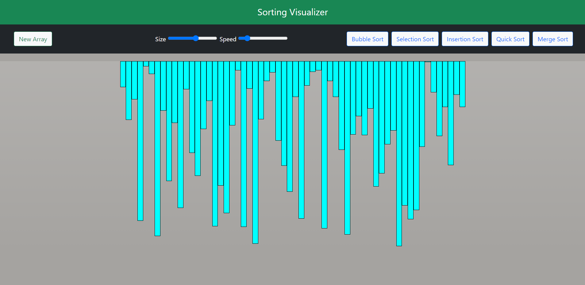
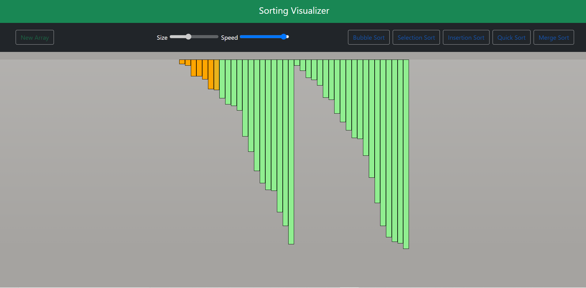
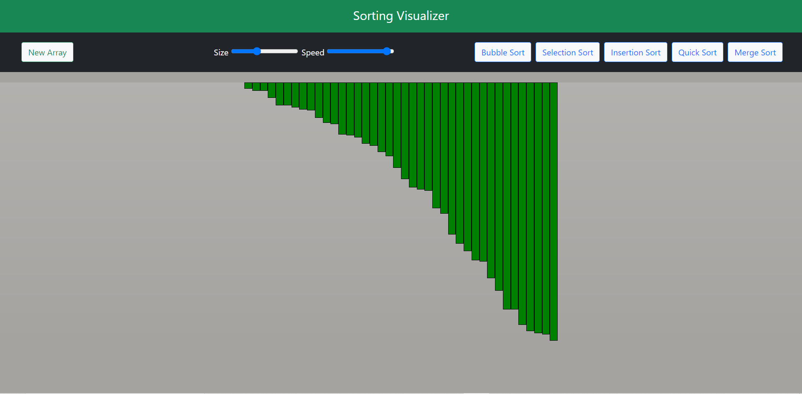

# This is Visualizer for sorting algorithms built using HTML, CSS, JS
We can click on new array button to generate a random array and select the desired size of the array and the speed of sorting from the sliders on the top right.
Then by clicking on the desired sorting algorithm, the sorting process starts.

### The following sorts are visualized:
- Bubble Sort 
- Selection Sort
- Insertion Sort
- Quick Sort
- Merge Sort

[Click Here!](https://kanavphull.github.io/sorting-algorithm-visualizer/) to use the visualizer on the website.
## Screenshots
  
  
  
